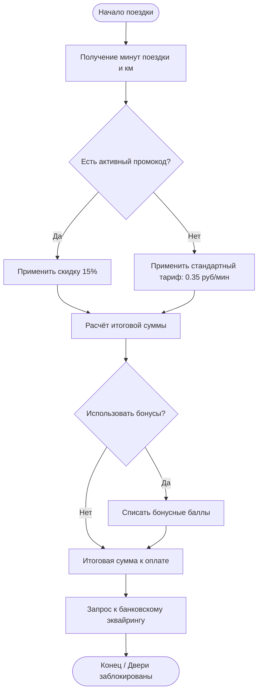

# Flowchart: Алгоритм расчёта стоимости поездки

```mermaid
flowchart TD
    Start([Начало поездки]) --> InputData[Получение минут поездки и км]
    InputData --> CheckDiscount{Есть активный промокод?}
    
    CheckDiscount -- Да --> ApplyDiscount[Применить скидку 15%]
    CheckDiscount -- Нет --> StandardRate[Применить стандартный тариф: 0.35 руб/мин]
    
    ApplyDiscount --> CalcTotal[Расчёт итоговой суммы]
    StandardRate --> CalcTotal
    
    CalcTotal --> CheckBonus{Использовать бонусы?}
    CheckBonus -- Да --> DeductBonus[Списать бонусные баллы]
    CheckBonus -- Нет --> FinalCharge[Итоговая сумма к оплате]
    
    DeductBonus --> FinalCharge
    FinalCharge --> BankReq[Запрос к банковскому эквайрингу]
    BankReq --> End([Конец / Двери заблокированы])
```