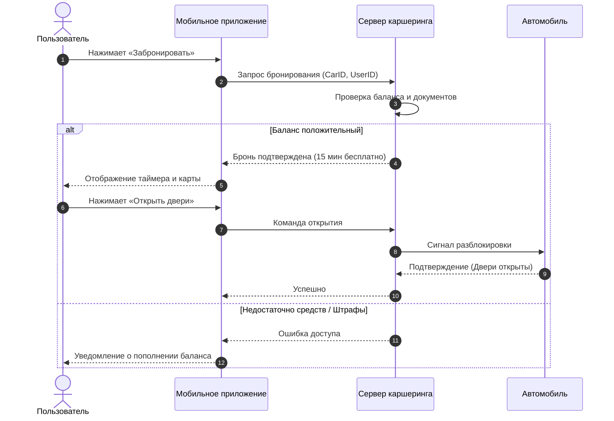

# Sequence Diagram: Авторизация и запуск аренды

```mermaid
sequenceDiagram
    autonumber
    actor User as Пользователь
    participant App as Мобильное приложение
    participant Server as Сервер каршеринга
    participant Car as Автомобиль

    User->>App: Нажимает «Забронировать»
    App->>Server: Запрос бронирования (CarID, UserID)
    Server->>Server: Проверка баланса и документов
    
    alt Баланс положительный
        Server-->>App: Бронь подтверждена (15 мин бесплатно)
        App-->>User: Отображение таймера и карты
        User->>App: Нажимает «Открыть двери»
        App->>Server: Команда открытия
        Server->>Car: Сигнал разблокировки
        Car-->>Server: Подтверждение (Двери открыты)
        Server-->>App: Успешно
    else Недостаточно средств / Штрафы
        Server-->>App: Ошибка доступа
        App-->>User: Уведомление о пополнении баланса
    end
```