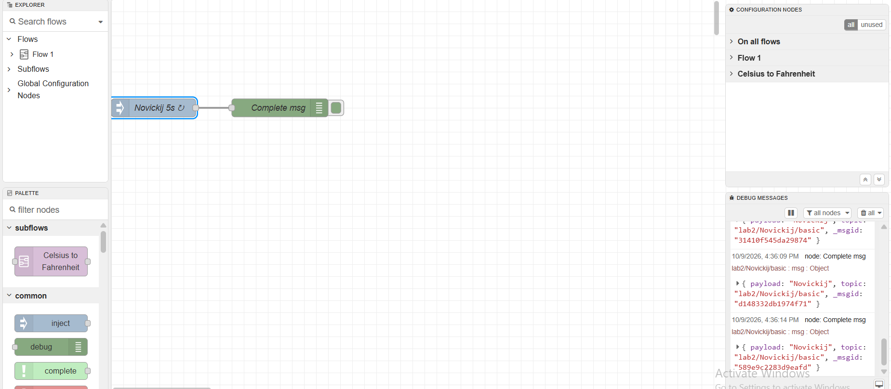
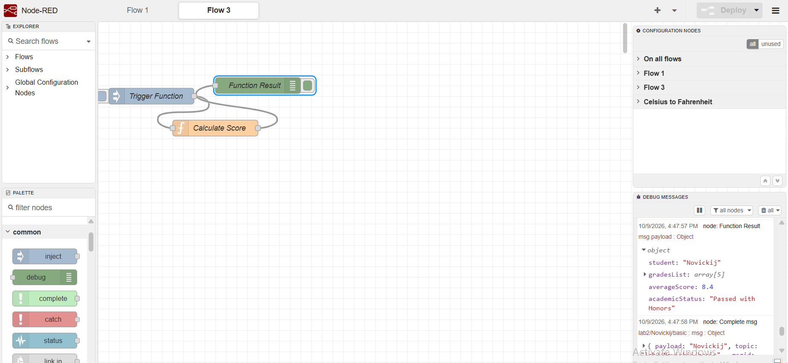
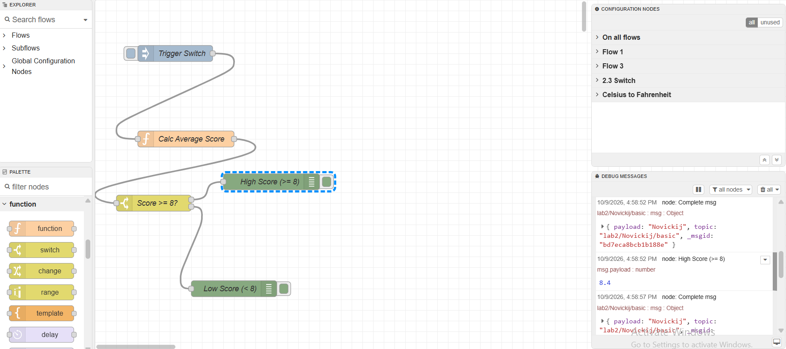
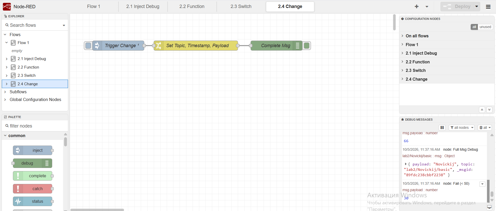
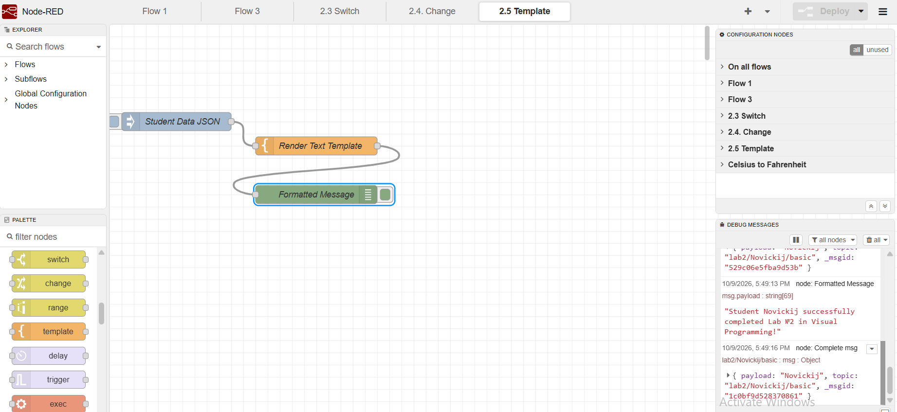
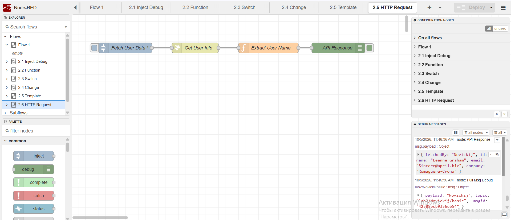
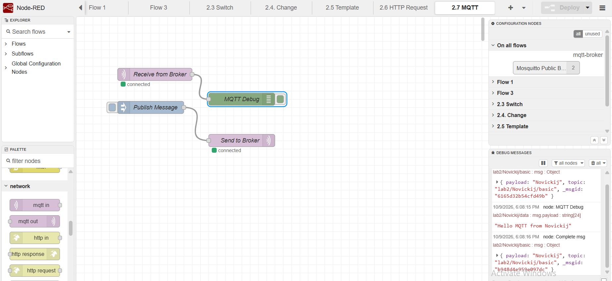
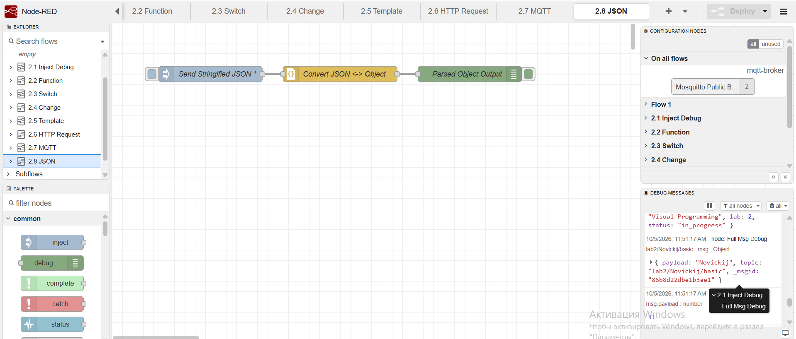
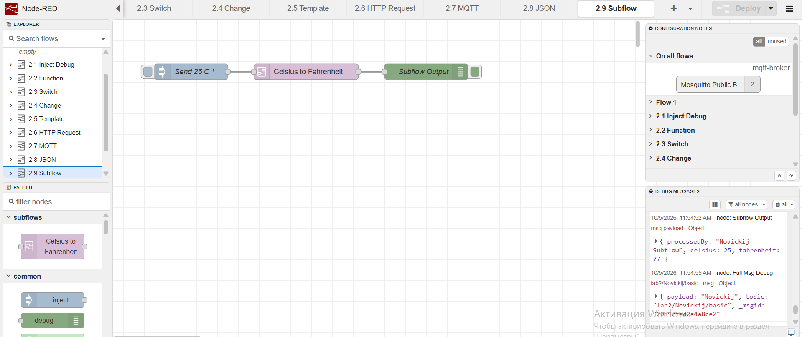
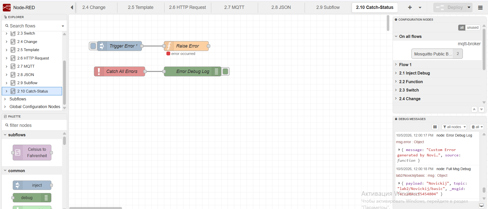

# Лабораторная работа №2. Визуальное программирование в Node-RED

**Студент:** Novickij  
**Курс:** Визуальное программирование  
**Среда:** Docker (`mynodered`), Node-RED v5.0.7, Node.js v24.20.0  

---

## 1. Проверка окружения
Контейнер Node-RED развёрнут и запущен в Docker. Версии ПО подтверждены через логи контейнера.

---

## 2. Реализованные потоки (Node-RED Flows)

### 2.1 Inject & Debug
* **Описание:** Базовый поток с автоматической генерацией сообщений каждые 5 секунд.
* **Файл:** `flows/flow-01-inject-debug.json`

### 2.2 Function Node
* **Описание:** Вычисление среднего балла студента и формирование итогового объекта через JavaScript-код.
* **Файл:** `flows/flow-02-function.json`

### 2.3 Switch Node
* **Описание:** Ветвление потока в зависимости от значений (разделение на Pass/Fail при пороговом значении 50).
* **Файл:** `flows/flow-03-switch.json`

### 2.4 Change Node
* **Описание:** Изменение и установка свойств `msg.topic`, `msg.timestamp` и `msg.payload` без использования JavaScript.
* **Файл:** `flows/flow-04-change.json`

### 2.5 Template Node
* **Описание:** Форматирование строки с использованием Mustache-шаблонов на основе входящего JSON-объекта.
* **Файл:** `flows/flow-05-template.json`

### 2.6 HTTP Request Node
* **Описание:** Отправка GET-запроса к внешнему REST API (`JSONPlaceholder`) и обработка ответа.
* **Файл:** `flows/flow-06-http-request.json`

### 2.7 MQTT Nodes (In/Out)
* **Описание:** Публикация и подписка на топики через публичный MQTT-брокер `test.mosquitto.org`.
* **Файл:** `flows/flow-07-mqtt.json`

### 2.8 JSON Node
* **Описание:** Преобразование JSON-строки в объект JavaScript (парсер).
* **Файл:** `flows/flow-08-json.json`

### 2.9 Subflow Node
* **Описание:** Переиспользуемый подпоток для конвертации температуры из Цельсия в Фаренгейт.
* **Файл:** `flows/flow-09-subflow.json`

### 2.10 Catch & Status Nodes
* **Описание:** Перехват ошибок потока и визуализация состояния ноды с помощью текстового статуса.
* **Файл:** `flows/flow-10-catch-status.json`
